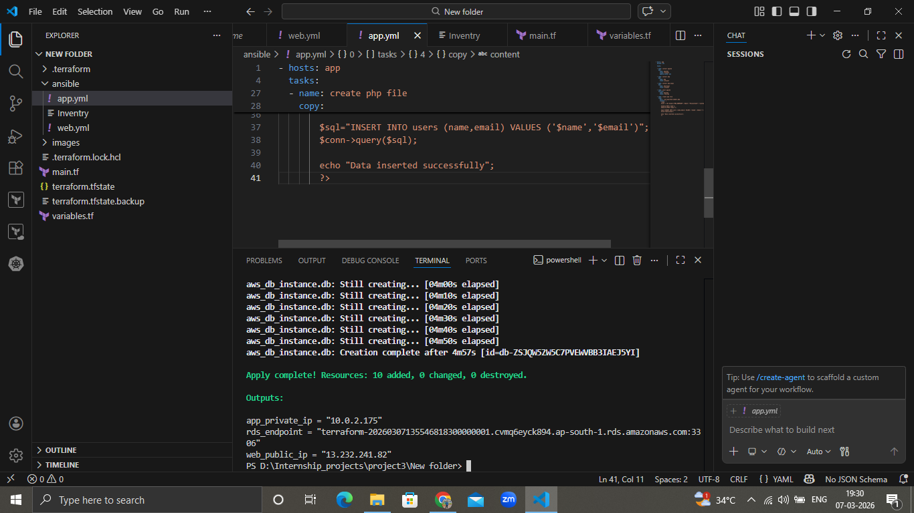
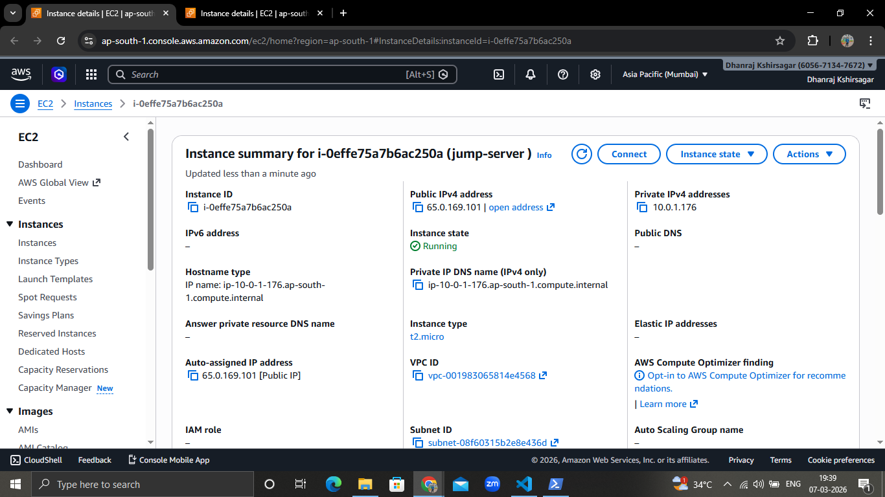
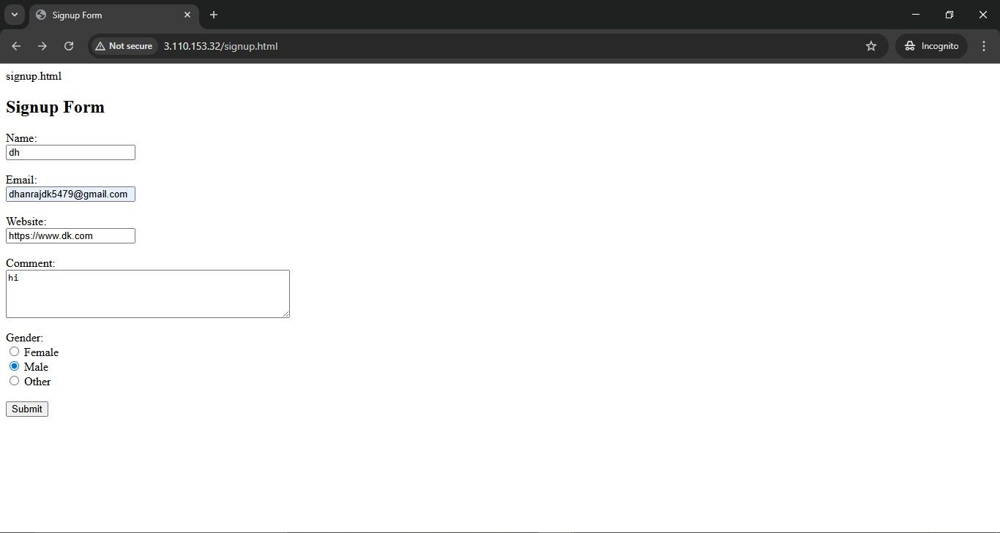
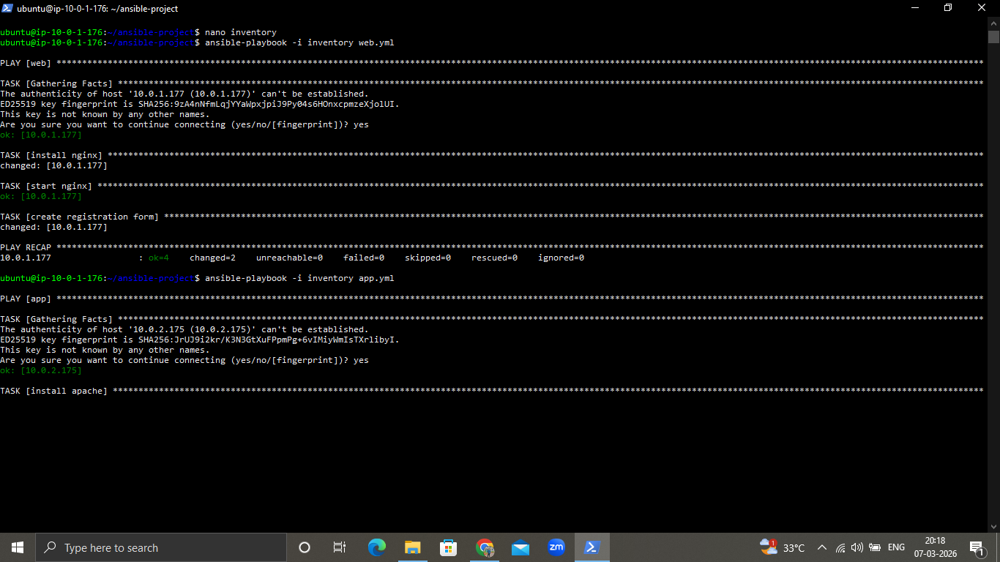
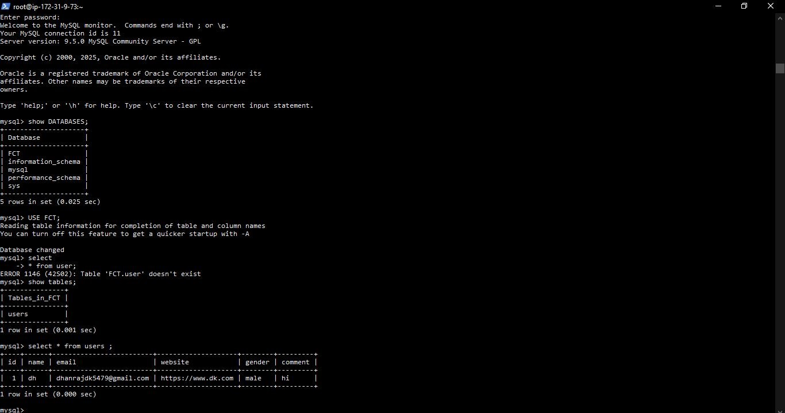

# AWS 3-Tier Infrastructure Deployment using Terraform and Ansible

## Project Overview

This project demonstrates the deployment of a **3-tier web application architecture on AWS** using **Terraform for infrastructure provisioning** and **Ansible for configuration management**.

The infrastructure consists of:

- Web Tier (Nginx Web Server)
- Application Tier (PHP Application Server)
- Database Tier (Amazon RDS)
- Jump Server (Ansible Control Node)

---

# Architecture Diagram



This architecture includes:

- VPC with Public and Private Subnets
- Internet Gateway for public access
- NAT Gateway for private subnet internet access
- Jump Server for Ansible management
- Web Server (Nginx)
- Application Server (PHP)
- RDS Database

---

# Jump Server (Ansible Control Node)

The Jump Server is used to securely access and configure private servers using Ansible.



Functions:

- Secure SSH access
- Runs Ansible playbooks
- Deploys application configuration

---

# Web Tier

The web server hosts a **registration form** built using HTML.



Features:

- Nginx installed using Ansible
- Publicly accessible through the internet
- Sends form data to the application server

---

# Application Tier

The application server processes the registration form and connects to the database.

Configuration tasks:

- Apache installed
- PHP installed
- PHP script deployed

Ansible automation used for server setup.



---

# Database Tier

The backend database is hosted on **Amazon RDS**.



Features:

- MySQL database
- Located in private subnet
- Accessible only from application server

---

# Terraform Deployment

Terraform is used to create all AWS resources automatically.


Terraform provisions:

- VPC
- Subnets
- Internet Gateway
- NAT Gateway
- EC2 instances
- RDS database

---

# Project Structure

```
project3
│
├── main.tf
├── variables.tf
│
├── ansible
│   ├── inventory
│   ├── web.yml
│   └── app.yml
│
├── images
│   ├── ansible.PNG
│   ├── database.jpg
│   ├── jump-server.PNG
│   ├── signup.jpg
│   └── terraform-op.PNG
│
└── README.md
```

---

# Deployment Steps

### 1 Clone the Repository

```

git clone https://github.com/Dhanrajdk79/aws-3tier-terraform-ansible.git

```

---

### 2 Initialize Terraform

```

terraform init

```

---

### 3 Deploy Infrastructure

```

terraform apply

```

---

### 4 Connect to Jump Server

```

ssh -i master.pem ubuntu@JUMP_SERVER_PUBLIC_IP

```

---

### 5 Run Ansible Playbooks

Configure Web Server

```

ansible-playbook -i inventory web.yml

```

Configure App Server

```

ansible-playbook -i inventory app.yml

```

---

# Application Workflow

1. User accesses the web server.
2. User fills the registration form.
3. Form data is sent to the application server.
4. Application server processes the request.
5. Data is stored in Amazon RDS.

---

# Security Best Practices

- Private subnet for backend servers
- Jump Server for SSH access
- NAT Gateway for private subnet internet access
- Security groups restricting database access

---

# Author

**Dhanraj Kshirsagar**

MCA – Cloud Computing (AWS & DevOps)

Skills:

AWS | Terraform | Ansible | Docker | Kubernetes | CI/CD